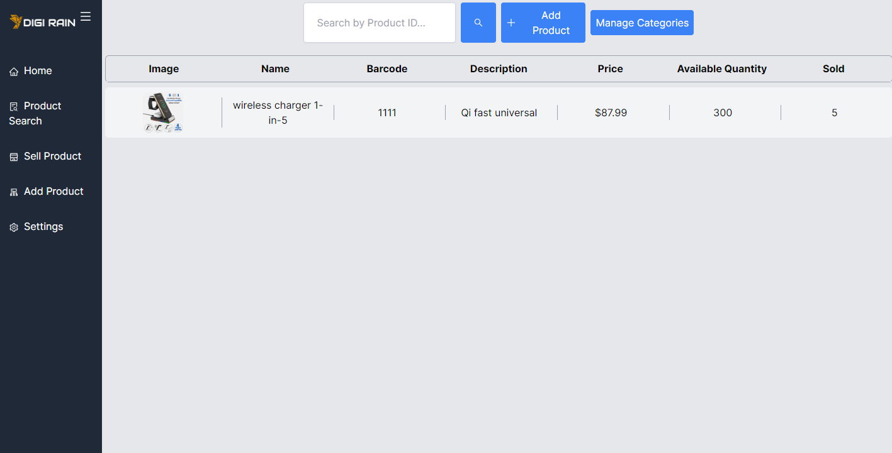

# NextLevelManager



NextLevelManager is an offline application built with Next.js and Electron.js to manage your shop and inventory. The application allows you to add or delete items from your inventory and automatically creates invoices for your in-store or online customers.

**Current Status:** Development

## Features
- Shop management
- Inventory management (add/delete items)
- Automatic invoice generation

## Getting Started

### Prerequisites
- Node.js (version 14 or higher)
- npm (version 6 or higher)

### Installation

1. Clone the repository:
    ```bash
    git clone https://github.com/kaveh2k/nextlevelmanager.git
    ```
2. Navigate to the project directory:
    ```bash
    cd nextlevelmanager
    ```
3. Install dependencies:
    ```bash
    npm install
    ```

### Running the Development Server

To run the development server, use the following command:

```bash
npm run dev
```
This command runs `npm run devNext` and `npm run electron` concurrently using the `concurrently` package to keep both servers running in parallel.

make sure to put your `menu-logo.png` picture in the `./DataBase` folder (or create this directory)

## Future Features

* Enhanced reporting and analytics
* User authentication and authorization
* Integration with online stores

# Dependencies

### Main Dependencies
* `archiver`
* `body-parser`
* `dotenv`
* `encoding-down`
* `level`
* `leveldown`
* `levelup`
* `next`
* `puppeteer`
* `react`
* `slick-carousel`
* `zustand`
* `react-icons`

### Development Dependencies
* `file-loader`
* `postcss`
* `prettier`
* `tailwindcss`
* `zustand-devtools`
* `autoprefixer`
* `concurrently`
* `electron`
* `electron-serve`
* `eslint`

# Contributing
Contributions are welcome! Please open an issue or submit a pull request.

# License
This project is licensed under the MIT License.

# Contact
Author: Kaveh \
Email: kaveh.au@protonmail.com


Feel free to adjust any part of it according to your preferences or project needs.


